# TravelSmart Database Schema

## Entity Relationship Diagram

```mermaid
erDiagram
    users ||--o{ user_social_accounts : "has"
    users ||--o{ user_traveler_tests : "takes"
    users ||--o| traveler_types : "assigned"
    users ||--o{ token_blocklist : "has"
    
    traveler_types ||--o{ question_option_scores : "scored_by"
    traveler_types ||--o{ user_traveler_tests : "results_in"
    
    questions ||--o{ question_options : "has"
    
    question_options ||--o{ question_option_scores : "scores"
    question_options ||--o{ user_answers : "selected_in"
    
    user_traveler_tests ||--o{ user_answers : "contains"
    
    itineraries ||--o{ accommodations : "includes"
    itineraries ||--o| transportations : "uses"

    users {
        uuid id PK
        string email UK
        string username UK
        string first_name
        string last_name
        string full_name
        string profile_picture_url
        text bio
        date date_of_birth
        string phone_number
        array visited_countries
        string country
        string city
        string timezone
        string status
        string role
        boolean email_verified
        datetime email_verified_at
        string email_verification_token UK
        datetime email_verification_token_expires
        string password_reset_token UK
        datetime password_reset_token_expires
        datetime password_changed_at
        string preferred_currency
        string preferred_travel_style
        json travel_interests
        json dietary_restrictions
        json accessibility_needs
        json countries_visited
        json languages_spoken
        string travel_experience_level
        json notification_preferences
        json privacy_settings
        string measurement_system
        string subscription_type
        datetime subscription_start_date
        datetime subscription_end_date
        boolean is_public_profile
        boolean allow_friend_requests
        boolean share_travel_stats
        datetime last_login_at
        json last_login_location
        datetime current_login_at
        json current_login_location
        int login_count
        int failed_login_attempts
        datetime last_failed_login_at
        json last_failed_login_location
        datetime account_locked_until
        json active_sessions
        datetime last_activity_at
        boolean two_factor_enabled
        string two_factor_secret
        json backup_codes
        boolean marketing_consent
        boolean newsletter_subscribed
        int total_trips_created
        int total_trips_completed
        json favorite_destinations
        boolean onboarding_completed
        int onboarding_step
        boolean first_trip_created
        boolean data_processing_consent
        datetime data_export_requested_at
        datetime data_deletion_requested_at
        datetime created_at
        datetime updated_at
        datetime deleted_at
        string referral_code UK
        uuid referred_by_user_id
        float referral_earnings
        text last_user_agent
        string preferred_language
        uuid traveler_type_id FK
    }

    user_social_accounts {
        uuid id PK
        uuid user_id FK
        string provider
        string provider_id
        string name
        string given_name
        string family_name
        string email
        string picture
        boolean is_verified
        datetime created_at
        datetime updated_at
        datetime last_used
    }

    traveler_types {
        uuid id PK
        string name UK
        string description
        string prompt_description
        string image_url
        datetime created_at
        datetime updated_at
        datetime deleted_at
    }

    questions {
        uuid id PK
        string question
        int order
        string category
        string image_url
        boolean multi_select
        datetime created_at
        datetime updated_at
        datetime deleted_at
    }

    question_options {
        uuid id PK
        uuid question_id FK
        string option
        string description
        string image_url
        datetime created_at
        datetime updated_at
        datetime deleted_at
    }

    question_option_scores {
        uuid id PK
        uuid question_option_id FK
        uuid traveler_type_id FK
        int score
        datetime created_at
        datetime updated_at
        datetime deleted_at
    }

    user_traveler_tests {
        uuid id PK
        uuid user_id FK
        uuid traveler_type_id FK
        datetime started_at
        datetime completed_at
        datetime created_at
        datetime updated_at
        datetime deleted_at
    }

    user_answers {
        uuid id PK
        uuid user_traveler_test_id FK
        uuid question_option_id FK
        datetime created_at
        datetime updated_at
        datetime deleted_at
    }

    itineraries {
        uuid itinerary_id PK
        string user_id
        uuid session_id
        string slug UK
        string destination
        date start_date
        int duration_days
        int travelers_count
        float budget
        string trip_type
        json tags
        text notes
        json details_itinerary
        string trip_name
        string visibility
        string status
        datetime created_at
        datetime updated_at
        datetime deleted_at
        uuid transportation_id FK
    }

    accommodations {
        uuid id PK
        uuid itinerary_id FK
        string city
        text url
        text title
        text description
        json img_urls
        string provider
        string status
        datetime created_at
        datetime updated_at
    }

    transportations {
        uuid id PK
        string transportation_details
    }

    token_blocklist {
        uuid id PK
        string jti UK
        string token_type
        uuid user_id FK
        datetime expires_at
        datetime revoked_at
        text reason
        datetime created_at
    }
```

## Table Descriptions

### Core Tables

#### **users**
Tabla principal de usuarios del sistema. Contiene información de perfil, autenticación, preferencias de viaje, suscripciones, seguridad y auditoría.

**Enums relacionados:**
- `UserStatusEnum`: ACTIVE, INACTIVE, SUSPENDED, PENDING_VERIFICATION
- `UserRoleEnum`: USER, PREMIUM, ADMIN, MODERATOR
- `CurrencyEnum`: USD, EUR, GBP, JPY, CAD, AUD, CHF, CNY, INR, BRL
- `TravelStyleEnum`: BUDGET, MID_RANGE, LUXURY, BACKPACKER, BUSINESS, FAMILY, SOLO, COUPLE, GROUP

#### **user_social_accounts**
Identidades de autenticación OAuth de usuarios (Google, etc.). Permite autenticación multi-proveedor.

**Constraints:**
- Unique constraint en `provider` + `provider_id`
- Index en `provider` + `provider_id`

#### **token_blocklist**
Lista de tokens JWT revocados/bloqueados para gestión de sesiones y seguridad.

**Enums relacionados:**
- `TokenType`: ACCESS, REFRESH

---

### Traveler Test System

#### **traveler_types**
Tipos/perfiles de viajeros (Aventurero, Cultural, Relajado, etc.).

#### **questions**
Preguntas del test de personalidad viajera.

**Constraints:**
- Check: `length(trim(question)) > 0`
- Check: `order > 0`

#### **question_options**
Opciones de respuesta para cada pregunta.

**Constraints:**
- Check: `length(trim(option)) > 0`

#### **question_option_scores**
Puntuaciones que cada opción aporta a cada tipo de viajero.

**Constraints:**
- Unique constraint en `question_option_id` + `traveler_type_id`
- Check: `score >= -10 AND score <= 10`

#### **user_traveler_tests**
Instancias de tests completados por usuarios.

**Constraints:**
- Check: `completed_at IS NULL OR completed_at >= started_at`
- Unique constraint en `user_id` + `started_at`

#### **user_answers**
Respuestas individuales de usuarios en cada test.

---

### Itinerary System

#### **itineraries**
Itinerarios de viaje creados por usuarios.

**Enums relacionados:**
- `VisibilityEnum`: PRIVATE, UNLISTED, PUBLIC
- `StatusEnum`: DRAFT, CONFIRMED
- `TripTypeEnum`: BUSINESS, LEISURE, ADVENTURE, FAMILY, ROMANTIC, CULTURAL, BACKPACKING, LUXURY, BUDGET, SOLO, GROUP

#### **accommodations**
Alojamientos asociados a itinerarios.

**Constraints:**
- Unique constraint en `itinerary_id` + `url`

#### **transportations**
Detalles de transporte para itinerarios.

---

## Relationships Summary

### User Relationships
- Un usuario puede tener múltiples cuentas sociales (OAuth)
- Un usuario puede tomar múltiples tests de viajero
- Un usuario puede ser asignado a un tipo de viajero
- Un usuario puede tener tokens bloqueados

### Traveler Test Relationships
- Un tipo de viajero tiene múltiples puntuaciones de opciones
- Una pregunta tiene múltiples opciones
- Una opción de pregunta tiene múltiples puntuaciones (una por tipo de viajero)
- Un test de usuario contiene múltiples respuestas

### Itinerary Relationships
- Un itinerario puede tener múltiples alojamientos
- Un itinerario puede usar un registro de transporte

---

## Database Indices

### users
- `id` (Primary Key)
- `email` (Unique)
- `username` (Unique)
- `referral_code` (Unique)
- `email_verification_token` (Unique)
- `password_reset_token` (Unique)

### user_social_accounts
- Composite index: `provider` + `provider_id`

### token_blocklist
- `jti` (Unique)
- `expires_at`

### itineraries
- `itinerary_id` (Primary Key)
- `user_id`
- `session_id`
- `slug` (Unique)
- `transportation_id`

### accommodations
- Composite unique: `itinerary_id` + `url`

---

## Soft Deletes

Las siguientes tablas implementan soft deletes mediante el campo `deleted_at`:
- `users`
- `traveler_types`
- `questions`
- `question_options`
- `question_option_scores`
- `user_traveler_tests`
- `user_answers`
- `itineraries`

---

## Cascade Delete Policies

### CASCADE (eliminar registros relacionados)
- `user_social_accounts` → `users`
- `accommodations` → `itineraries`
- `question_options` → `questions`
- `question_option_scores` → `question_options`
- `question_option_scores` → `traveler_types`
- `user_traveler_tests` → `users`
- `user_answers` → `user_traveler_tests`
- `user_answers` → `question_options`

### SET NULL (establecer a null)
- `users.traveler_type_id` → `traveler_types`

### RESTRICT (evitar eliminación)
- `user_traveler_tests.traveler_type_id` → `traveler_types`

---

## Database Technology

- **Database Engine**: PostgreSQL
- **ORM**: SQLAlchemy
- **Migration Tool**: Alembic
- **UUID Support**: PostgreSQL UUID type
- **Array Support**: PostgreSQL ARRAY type for string arrays
- **JSON Support**: PostgreSQL JSON type for complex data structures

---

*Última actualización: Octubre 2025*

